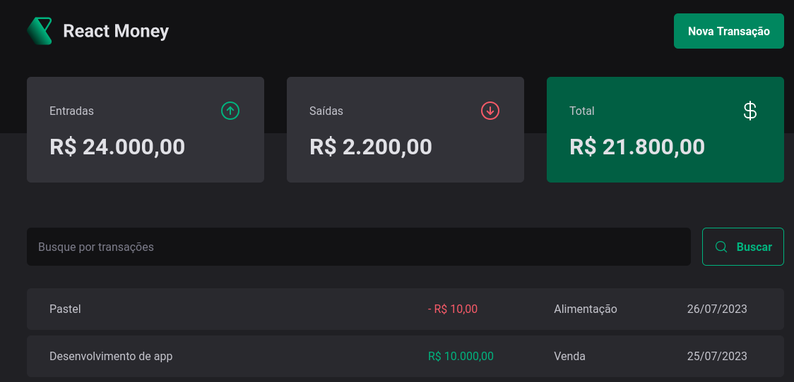

<h1 align="center">Welcome to React Money 👋</h1>
<p align="center">
  
</p>
<p align="center">
  
  <a href="https://twitter.com/BrenoFQ" target="_blank">
    
  </a>

  <h3 align="center"> A simple Finance application to study React and TypeScript </h3>
</p>


### 🏠 [Homepage](react-money-nine.vercel.app)

## Install

```sh
npm install
```

## Usage

```sh
npm run dev
```

## Author

👤 **Breno Quirino**

* Twitter: [@BrenoFQ](https://twitter.com/BrenoFQ)
* Github: [@brenoq](https://github.com/brenoq)

## Show your support

Give a ⭐️ if this project helped you!